# CSc 110 - 1 Dimensional Chess

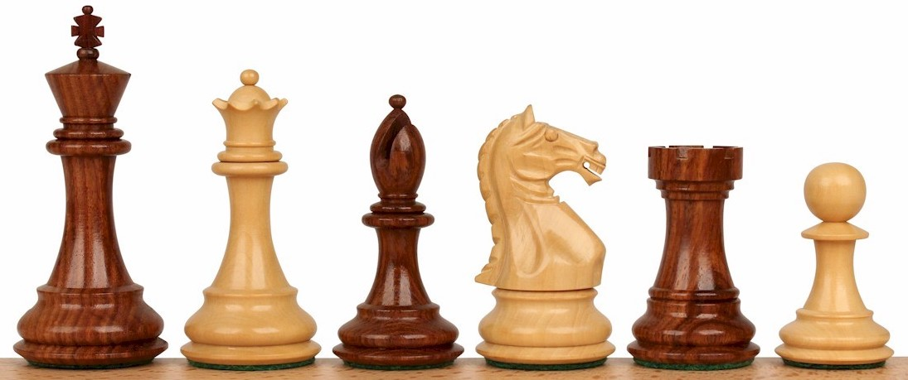

Each player gets 16 pieces (one player uses white pieces, the other black), one of those pieces being a king, and they must start the game with a pre-defined piece setup.
The goal of the game is to **checkmate** the opponents king.
To checkmate the king is to put the opponent in a position where they cannot make a move without allowing the opponent to kill the king on his next move.
There are more rules, but that is the main idea.
Below, a chess board is shown in the initial game state (before either of the players have made a move).

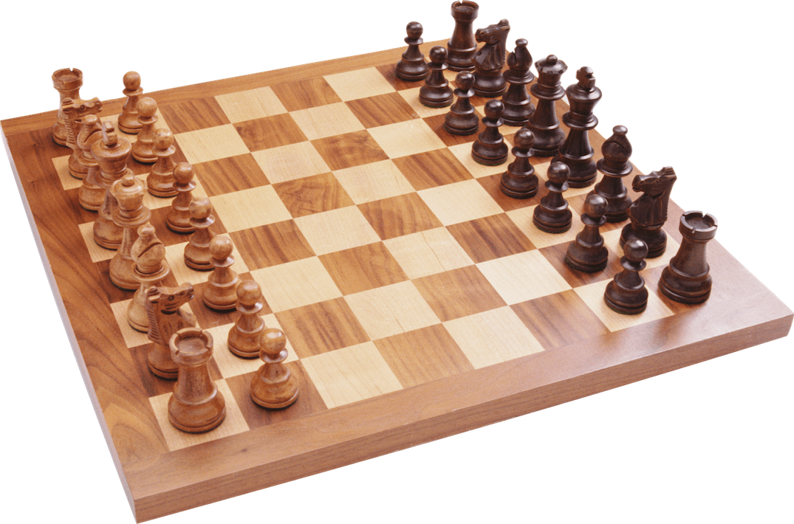

Implementing a fully-featured game of chess might be a daunting task for some of you, given the amount of programming experience that you have.
Thankfully, in this assignment, you won't have to!
In this PA, you will be implementing a simpler variant of chess: 1D Chess!
1D chess is a variant of the game that is played on a board that has only one column of spaces, rather than a grid of spaces, as in typical chess.
There are actually [multiple variants of 1D chess](https://www.chessvariants.com/shape.dir/onedim.html).
In this PA, you should implement a custom variant of 1D chess, which I'll refer to as "110 1D chess".

## 1D Chess Rules

In 110 1D chess, the board will be 1 by 9.
Each player will get one king, and two knights.
The white pieces go on the left, and the black on the right.
The starting positions for the pieces of the game should be as follows:

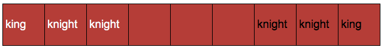

Kings and Knights move and kill their opponents differently.
Knights can move either left or right, and when they move thy jump two pieces over.
If they land on another piece, they kill them and take their spot.
The king can move left or right, until they hit either another piece or an edge of the board.
If a king hits another piece, they kill them and take their place.
In chess, a player cannot typically kill one of their own pieces.
In 110 1D chess, a king or knight **can** kill one of their own, if they hit or land on them, so be careful!

## An Example Game

Below is an exam play out of a game of 110 1D chess.
The starting position is shown below.

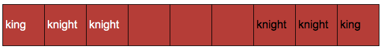

White goes first in chess.
White chooses to move the knight at index 2 (0-based indexing) to the right.

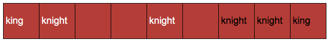

Then, black chooses to move the knight at index 6 to the left, killing a white knight.

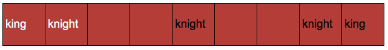

Next, white chooses to move the knight at index 1 to the right.

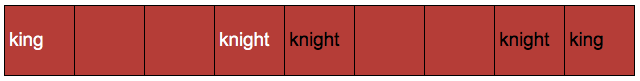

Black moves a knight to the left.

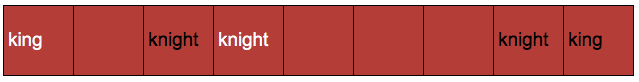

White moves the king to the right, killing a black knight.

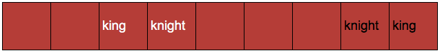

Black moves his remaining knight to the left.

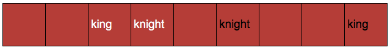

White takes the black knight with the remaining white knight.

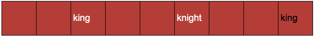

Black moves the king to the left, killing the last white knight.

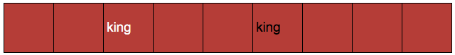

Lastly, white can move the king to the right, taking the place of and killing the black king.
If white did so, white would win this particular game.

## Program Structure

For this PA, we will actually be providing some started code.
The starter code will include some constants, a main function (already coded), and a bunch of function definitions, which you will need to implement!
Thus, in this PA, you should not attempt build the program completely from scratch.
Rather, you should implement a handful of functions to get the game to work properly.
Click the link below to download the starter code:

### [chess.py](./chess.py)

Before you start working on the functions, make sure you read through the starter code carefully.

## Restrictions and Requirements

* This program must follow the style guidelines.
* You should structure all of your code into the provided function definitions.
* You are not allowed to change main, other than commenting out the lines for graphics.
* You are not allowed to have any code outside of a function.
* You should not write any string literals in any function other than `print_board`, `draw_board`, and to print out the winning team.
  Other than that, you should use the provided constants.
* Make sure you write detailed function comments for every function in chess.py, other than `main`.

## Functions to Implement

There are a number of functions which you should implement to get the game working properly.
There will be both a text representation of the game, and a graphical representation of the game.
Initially, don't worry about the graphical representation.
Below, I provide a description of what each function should do.
It is up to you to implement them, and then test that they are working properly!
I recommend you implement them in the order that they are described in the specification.

### print_board

This functions should have one parameter variable, the board list.
The job of this function is to simply print out the board to standard output.
If the board is passed in and in the initial game state, the output should look like so:

```
+-----------------------------------------------------+
| WKi | WKn | WKn |     |     |     | BKn | BKn | BKi |
+-----------------------------------------------------+
```

### is_valid_move

This function has three parameter variables.
The board (a list, representing the 1 by 9 board), the position (index) of the player to move, and player (WHITE or BLACK).
This function should return a boolean (`True` or `False`).
True if the desired move is valid, False otherwise.
A Move is valid if:

* The position (index) is a valid index into the board list.
* The position is a position (index) of one of the current player's pieces on the board.

You do not need a while loop or for loop within this function.
It can be accomplished with if statements.
If the above two conditions are True, the function should return True.
In any other case, return False.

### move

This function has three parameter variables.
The board (a list, representing the 1 by 9 board), the position (index) of the player to move, and a direction (either `'l'` or `'r'`).
This function should determine if the piece to be moved is a king or a knight.
If it is a king, call the `move_king` function.
If a knight, call `move_knight`.

### move_king

This function has the same three parameters as the move function.
`move_king` should actually move a king on the board (thus, it should change the board list).
In 110 1d Chess, a king can move either left or right.
The king will move until either it reaches another piece (killing that piece and taking it's place), or an end of the board.

This function should move the king at the provided position in the correct direction.
You should use a for-loop or while-loop to iterate through the elements in the list and determine the spot it should end up at.

### move_knight

This function has the same three parameters as the move function.
`move_knight` should actually move a knight on the board (thus, it should change the board list).
In 110 1d Chess, a knight can move either left or right.
A knight moves 2 locations.
If it lands on a space that another piece occupies, then it kills that piece.
It can jump over other pieces.
If it cannot move due to the ending position of the move being out-of-bounds of the board, the knight should stay in it's place.

This function should move the knight at the provided position in the correct direction.

### is_game_over

This function should take the board list as it's only parameter, and should determine if the game is over or not.
If the white king does not exist on the board, then the game is over, and black wins.
In this case, the function should print the board, print `Black wins!` and return true.
If the black king does not exist on the board, then the game is over, and white wins.
In this case, the function should print the board, print `White wins!` and return true.
If both kings are still in the board list, then the function should print nothing, and return false.

### draw_board

This game can be played purely on the command line, as long as you have implemented the `print_board` function.
However, you should also implement `draw_board`.
This function should display the board on a graphical canvas using the graphics module.

This function has two parameters, the board list and a graphics object.
This function should display a graphical representation of the board.
This function is already called from main, and the gui variable is defined in main.
You should use the `gui` variable and the board to display it graphically.
The board should appear roughly as shown below, but the pieces should show up in the locations that they are in in the board list.

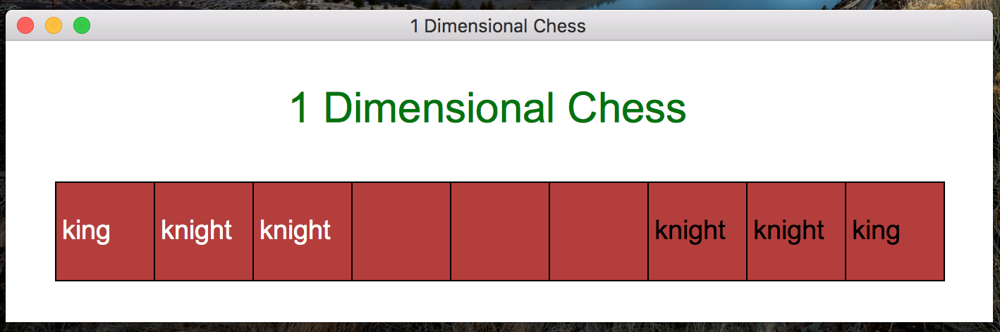

The white pieces should display in white words, and black in black words.
You should also include the string "1 Dimensional Chess" in the bar and above the board on the canvas.
If you have the time and ability, you can make the canvas more interesting.
You can even draw out an icon for the king and knight, instead of using a word to represent them.

**Don't forget to call `update_frame` at the end of the `draw_board` function!**

Also, you'll want to use the `text` function to display text on the canvas.
The text function takes 5 arguments: the x position, y position, the label (text) to display, color, and size.
For instance, to display the words "hi there" on a canvas in green, you could run this:

```
gui = canvas(200, 200, 'canvas')
gui.text(50, 50, 'hi there', 'green', 25)
gui.update_frame()
```

## Submission

This PA is due on October 25th, at 7pm.
You should turn it in on Gradescope.
Remember: There will be an autograder for this, but there will not be an Gradescope autograder test case for the graphics portion.

