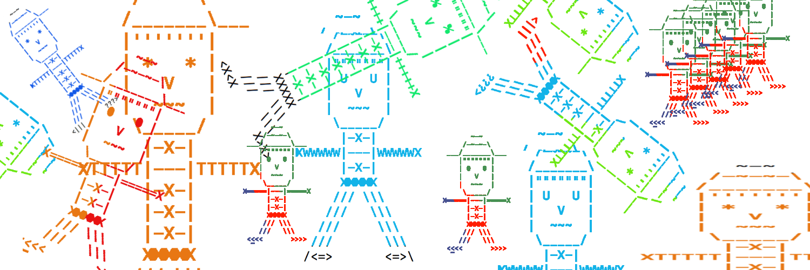

# CSc 110 - Avatar



Many of you have probably selected or created an avatar, perhaps for a video-game or a profile image.
There are also general-purpose avatar creators online, such as [avatarmaker.com](https://avatarmaker.com/).
These tools can be used to create an avatar for use on various online accounts.

In this assignment, you will be writing a console-based avatar creation tool.
The program that you build will allow the user to build a custom avatar, or select from 3 pre-designed ones.
The avatars that this program will create will not be of just a face, but rather, an avatar body.
All of the interaction for this program will happen on the command-line.
Part of the purpose of this PA is to get you to use and better understand functions, parameters, if-statements, and while-loops.
Name your program `avatar.py`.

## Program Behavior

The program will begin with a title and then a prompt to select / create an avatar:

```
----- AVATAR -----
Select an Avatar or create your own:
```

This prompt will wait user input.
At this point, the user can do one of several things:

* Type `exit` to end the program without printing out an avatar.
* Type `custom` to begin the custom avatar creation interface.
* Choose from one of three pre-defined avatars.
  The names of the three pre-defined avatars are `Jeff`, `Jane`, and `Chris`.

If anything other than `exit`, `custom`, `Jeff`, `Jane`, or `Chris` is entered, the program will just repeat the question until a valid input is entered.
After the name is entered, the avatar is printed and then the program ends.

Jeff, Jane, and Chris are shown below.
If one of these is selected, you should print out this exact character and then the program can end.


<table>

<tr>
  <td style="background-color:#ededed;"><b>Jeff</b></td>
  <td style="background-color:#ededed;"><b>Jane</b></td>
  <td style="background-color:#ededed;"><b>Chris</b></td>
</tr>

<tr>
  <td class="topic-general">
    <pre><code>       ~-~       
     /-~-~-\     
 ___/_______\___ 
    |'''''''|    
    | 0   0 |    
    |   V   |     
    |  ~~~  |     
     \_____/     
      |-X-|      
 0====|---|====0
      |-X-|      
      |-X-|      
      |-X-|      
      |-X-|      
      HHHHH      
     /// \\\
    ///   \\\
#HHH#       #HHH# </code></pre>
  </td>
  <td class="topic-general">
    <pre><code>       ~-~       
     /-~-~-\     
    /_______\___ 
   "|"""""""|"    
   "| *   * |"   
   "|   V   |"    
   "|  ~~~  |"    
   " \_____/ "   
 0TTTT|---|TTTT0
      |-X-|      
      |-X-|      
      HHHHH      
     /// \\\
    ///   \\\
   ///     \\\
<|||>       <|||> </code></pre>
  </td>
  <td class="topic-general">
    <pre><code>       ~-~       
     /-~-~-\     
    /_______\    
    |'''''''|    
    | U   U |    
    |   V   |     
    |  ~~~  |     
     \_____/     
      |-X-|      
 0WWWW|---|WWWW0
      |-X-|      
      |-X-|      
      HHHHH      
     /// \\\
    ///   \\\
   ///     \\\
  ///       \\\
<>-<>       <>-<></code></pre>
  </td>
</tr>

</table>

Take a close look at the above avatars.
There are many similarities, but also some key differences.
The differences of note are:

* All of then have a similar cap on, but one is a top-hat, one is a cam to the right, and the other is facing forward.
* They all have the same basic face structure, but with two types of hair (single-quotes and double-quotes) showing below the hat, and differing eyes.
* Similar neck/torso style, but with varying height.
* Similar arms, but with varying characters used.
* Similar legs, but with varying lengths and shoes.

If `custom` is selected, then the program should prompt the user for a number of look customization options.
There are 7 total options to select, and the program should ask for the inputs one-by-one.
The prompts should look as follows (example values shown after the question-marks).

```
Select an Avatar or create your own:
custom
Answer the following questions to create a custom avatar
Hat style ?
right
Character for eyes ?
^
Long hair (True/False) ?
False
Arm style ?
P
Torso length ?
3
Leg length (1-4) ?
3
Shoe look ?
<###>
```

This sequence of inputs should produce this avatar:

```
       ~-~
     /-~-~-\
    /_______\___
    |'''''''|
    | ^   ^ |
    |   V   |
    |  ~~~  |
     \_____/
 0PPPP|---|PPPP0
      |-X-|
      |-X-|
      |-X-|
      HHHHH
     /// \\\
    ///   \\\
   ///     \\\
<###>       <###>
```

Each of the options control something about the look of the printed avatar.
All of the inputs are collected, and then the avatar is printed using the values.
More test cases of custom avatars will be provided via the gradescope tests.

## Custom Input Values

This section explains what each input values controls.
Each of the inputs have an expected format.
However, you do not need to validate all of these inputs.
You may assume that the user will enter a value that follows the rules for all of them.

### Hat Style

Can be `left`, `right`, `both` or `front`.
If an invalid value is entered, the default is `front`.
These correspond to:

<table>

<tr>
  <td style="background-color:#ededed;"><b>left</b></td>
  <td style="background-color:#ededed;"><b>right</b></td>
  <td style="background-color:#ededed;"><b>both</b></td>
  <td style="background-color:#ededed;"><b>front</b></td>
</tr>

<tr>
  <td class="topic-general">
    <pre><code>       ~-~       
     /-~-~-\     
 ___/_______\    </code></pre>
  </td>
  <td class="topic-general">
    <pre><code>       ~-~       
     /-~-~-\     
    /_______\___ </code></pre>
  </td>
  <td class="topic-general">
    <pre><code>       ~-~       
     /-~-~-\     
 ___/_______\___ </code></pre>
  </td>
  <td class="topic-general">
    <pre><code>       ~-~       
     /-~-~-\     
    /_______\    </code></pre>
  </td>
</tr>

</table>

### Hair

The user should enter either `True` or `False`.
This determines wether or noth the avatar should have long hair or short hair.
The table shows what True/False correspond to:

<table>

<tr>
  <td style="background-color:#ededed;"><b>True</b></td>
  <td style="background-color:#ededed;"><b>False</b></td>
</tr>

<tr>
  <td class="topic-general">
    <pre><code>   "|"""""""|"    
   "| *   * |"   
   "|   V   |"    
   "|  ~~~  |"    
   " \_____/ "    </code></pre>
  </td>
  <td class="topic-general">
    <pre><code>    |'''''''|   
    | *   * |    
    |   V   |     
    |  ~~~  |     
     \_____/      </code></pre>
  </td>
</tr>

</table>

### Eye Character

Pretty simple - controls which character should be used for the eyes.
The user should enter just one character, not a long string.

### Arm Style

This input should be a single character, as with the eyes.
This character will be used for the arm of the avatar.
`0` is always used for the hand, and `|---|` is always used for the body portion.
The entered character should only change the actual arm component.

### Torso Length

Controls the length (height) of the torso.
The value entered should be any positive integer.
Below are examples of various torso lengths.

<table>

<tr>
  <td style="background-color:#ededed;"><b>3</b></td>
  <td style="background-color:#ededed;"><b>5</b></td>
  <td style="background-color:#ededed;"><b>7</b></td>
</tr>

<tr>
  <td class="topic-general">
    <pre><code>      |-X-|      
      |-X-|      
      |-X-|      </code></pre>
  </td>
  <td class="topic-general">
    <pre><code>      |-X-|      
      |-X-|      
      |-X-|      
      |-X-|      
      |-X-|      </code></pre>
  </td>
  <td class="topic-general">
    <pre><code>      |-X-|      
      |-X-|      
      |-X-|      
      |-X-|      
      |-X-|      
      |-X-|      
      |-X-|      </code></pre>
  </td>
</tr>

</table>

### Leg Length

Controls the length (height) of the legs.
The value entered should be a positive integer between 1 and 5.
Below are examples of the various leg length possibilities.

<table>

<tr>
  <td style="background-color:#ededed;"><b>1</b></td>
  <td style="background-color:#ededed;"><b>2</b></td>
  <td style="background-color:#ededed;"><b>3</b></td>
  <td style="background-color:#ededed;"><b>4</b></td>
</tr>

<tr>
  <td class="topic-general">
    <pre><code>      HHHHH      
     /// \\\     </code></pre>
  </td>
  <td class="topic-general">
    <pre><code>      HHHHH      
     /// \\\     
    ///   \\\    </code></pre>
  </td>
  <td class="topic-general">
    <pre><code>      HHHHH      
     /// \\\     
    ///   \\\    
   ///     \\\   </code></pre>
  </td>
  <td class="topic-general">
    <pre><code>      HHHHH      
     /// \\\     
    ///   \\\    
   ///     \\\   
  ///       \\\  </code></pre>
  </td>
</tr>

</table>

### Shoes

The input here should be a string that is exactly 5 characters long.
That is the amount of space allocated for shoes.
There can be empty-spaces in the string.
The shoe style provided should be used for both the left and right shoe.

## Development Strategy

Perhaps you've noticed by now, but there are a lot of "chunks" of predefined and custom avatars that are similar.
For example, all of the avatars have torso sections, but the height of them varies.
All of the avatars have the same face structure, but the eyes and hair can change.

You should write a *function* that is responsible for printing each "chunk" of the avatar.
Thus, your program must have at least six functions to receive full points: A main function, and a function for each of the following chunks: the hat, face, arms, torso, and legs.
The parameters of each function should be the values that control the look.

For example, you could write a function called `def hat(direction):`, where the `direction` is a string indicating which style to print.
Within the function, you can have if-statements that allow different styles to be printed.
For the face, you could create a function named `def face(hair, eyes):`.
This function will have the standard face shape print out, but use the `hair` and `eyes` parameters to change those specific parts of the face.
You should end up with a function for each part of the body.

You should use these functions for printing the custom avatars, as well as the three pre-defined ones.
You should not hard-code the printing out of Jane, Jeff and Chris.
Instead, you must use these functions.

See the differ tool and/or Gradescope for examples of complete runs.

## Restrictions

You are _not_ allowed to use _any_ string multiplication on this program, except for the legs of the avatar.
For the torso height and legs, you should try to use while-loop rather than hard-coding.
Also, all of your code should be organized into functions.
The only code that may not be in a function is a call to `main()`.
You are not allowed to have any global variables.
You also should not use the `exit` function for this PA.

## Due Date

This PA is due Tuesday, October 4th at 7:00pm.
Turn it in on Gradescope.
You should try to make sure that all of the test cases pass before you turn it in.
You can still submit without all of the cases passing, but that is not preferable.

