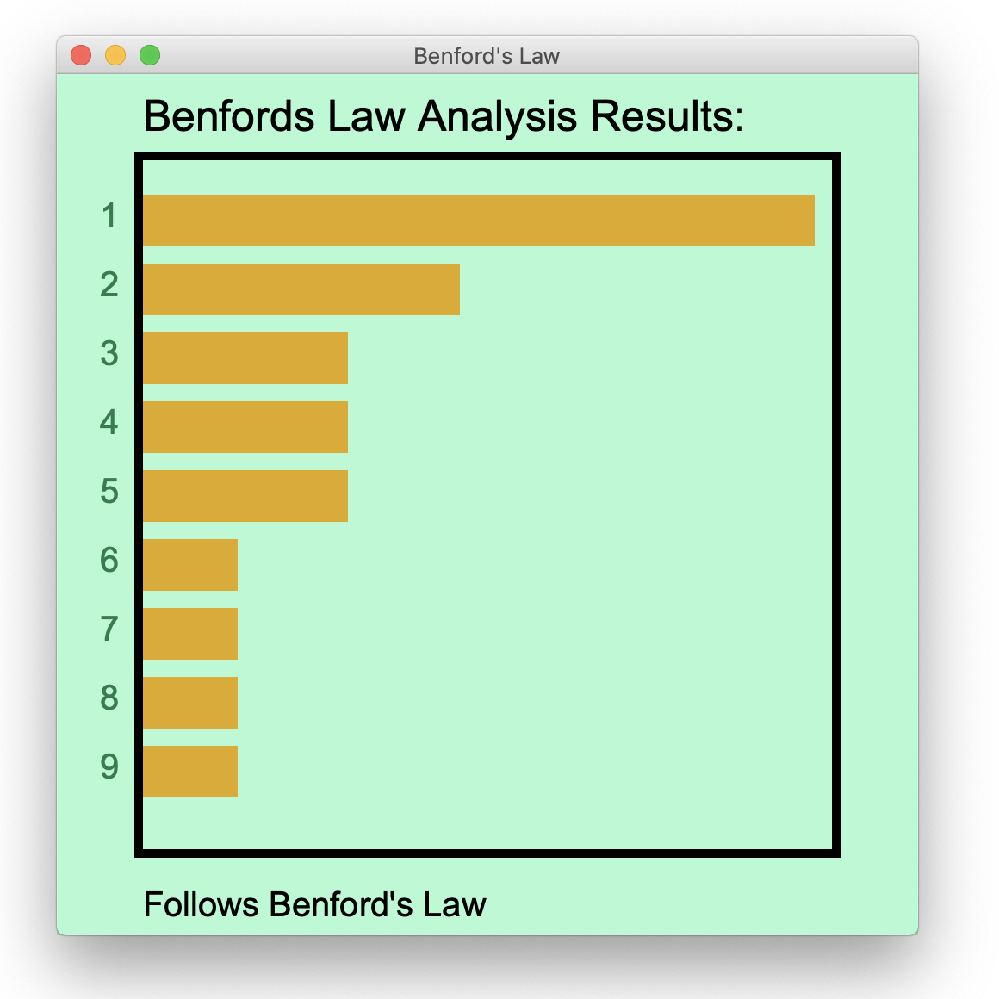
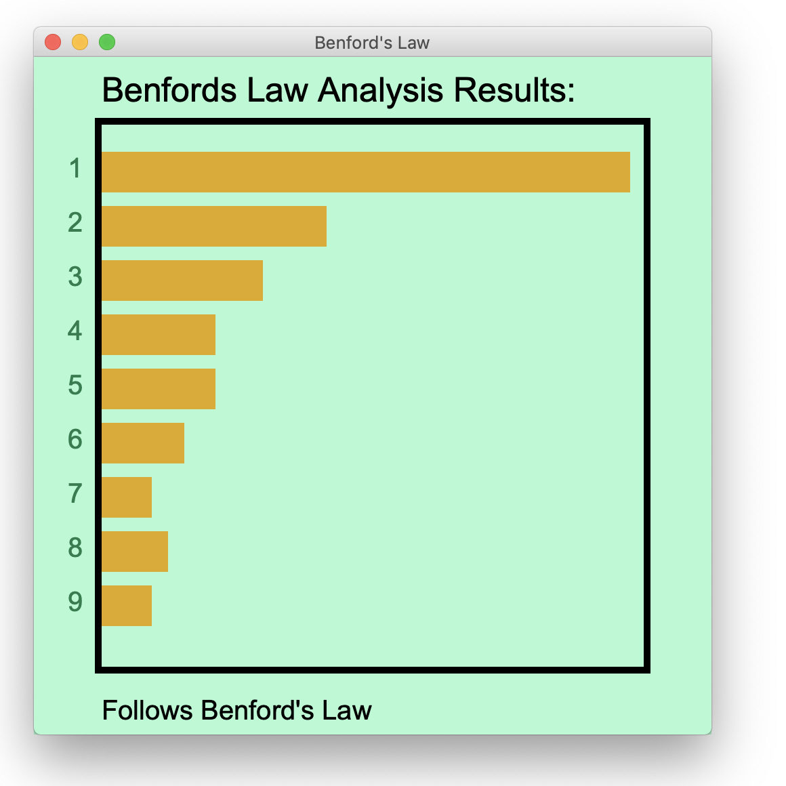
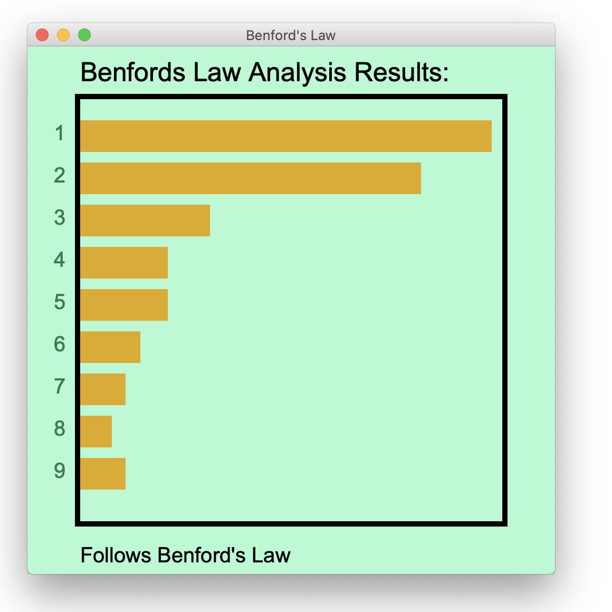
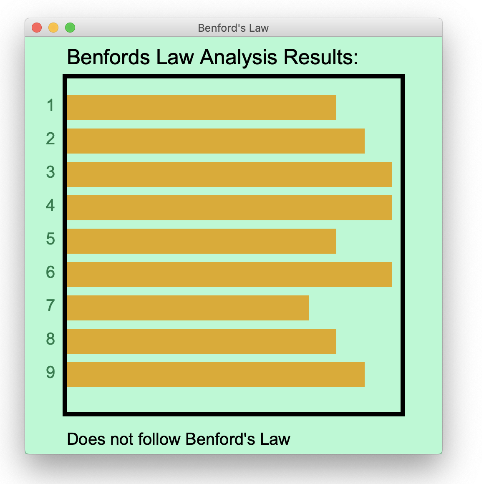

# Benford's Law

Benford's Law is a mathematical law that describes the behavior of naturally-occurring numbers in some kinds of numerical data sets.
Benford's Law makes the claim that in data sets containing naturally-occurring numbers, the leading digit for any given number in the data set tends to be smaller digits.
In such data sets, the leading digit for a given number is most-likely to be 1, next-most likely to be 2, and so on.
9 is the least-likely leading digit for any number in the data set.
At first glance, this may seem like an unusual phenomenon, but it has been shown to hold true.
This assignment specification does not go into detail explaining how and why this is true from a mathematical perspective, but there are a number of resources online that you can dig into if you are interested in the details.
You can start by taking a look at the [Wikipedia Page](https://en.wikipedia.org/wiki/Benford%27s_law) fro more information.
You may also consider watching thie video too:

<iframe width="560" height="315" src="https://www.youtube.com/embed/XXjlR2OK1kM" frameborder="0" allow="accelerometer; autoplay; clipboard-write; encrypted-media; gyroscope; picture-in-picture" allowfullscreen=""></iframe>

One of the practical use-cases of Benford's law is for distinguishing naturally occurring data from randomized or made-up data.
It has been used in the real world to detect election fraud (For example, in the 2009 Iranian election).
It has also been used as evidence in criminal cases in the US.
In this assignment, you'll be writing a program that reads in a data set, visualizes the distribution of the leading digits of the numbers, and determines of the data set follows the law or not.
You should name your code file `benfords_law.py`.
You should organize the code into several functions: A main, a function for loading the data from the file, one for counting the occurrences, and one (or more) for displaying the results.

## The Input File

Your program should ask the user for the name of an input file, which your program should expect to be formatted as CSV.
As a reminder, a CSV file is one that is organized into rows and columns,a  commas are typically used as the character that separates each entry in a row.
Shown below is an example of the program prompting the user for a file name, then the user enters a file name (`places.csv`), and then the program prints out the resulting plot.

```
Data file name:
places.csv

1 | ###############################
2 | ##############
3 | ##########
4 | ########
5 | #######
6 | #####
7 | ####
8 | ####
9 | ####

Follows Benford's Law
```

After opening up the input file, the program should search through the CSV data for numerical values.
The way you should do so is as follows:

* Create an empty list, in which you will append every number you find
* Loop through each line of the file
    * For each line, split on a comma (due to it being CSV)
        * For each element that you get from splitting, if the FIRST character and LAST character is a numeric digit, and if the first digit is not `0`, then convert the string to a float and append to the list of numbers.
        * (NOTE: In the real-world, we probably would want to do a more thorough check to determine if a value is truly a number. For the purpose of this assignment, these checks are sufficient and is what you should use.)

For example, say you had this data file named `places.csv`:

```
region,population
pima,1234
georgia,145
steele,10
tampa,1700
greece,1729
rome,1711
milan,219
tucson,231
tuscany,20001
florence,301
nigeria,3879
newyork,404
phoenix,40123
belgium,505
madrid,502
nogales,601
brussels,712
tempe,81231
anthem,91231
```

After reading it in, your numbers list should be:

```
numbers = [1234.0, 145.0, 10.0, e700.0, 1729.0, 1711.0, 219.0, 231.0, 20001.0, 301.0, 
           3879.0, 404.0, 40123.0, 505.0, 502.0, 601.0, 712.0, 81231.0, 9123.0]
```

In the next step, you should use this list of numbers to build the plot.

## The Plot

In order to create the plot, you will first have to loop through the numbers list and count how many times a number starts with the digit `1`, the digit `2`, the digit `3`, and so on up to `9`.
I recommend that you use a dictionary for this counting.
If you have a floating-point number `x`, you can get the first digit as an int by doing `int(str(x)[0])`.
Based on the `places.csv` data shown earlier, the counts dictionary should be as follows after counting:

```
counts = {1: 6, 2: 3, 3: 2, 4: 2, 5: 2, 6: 1, 7: 1, 8: 1, 9: 1}
```

If you forgot how to use a dictionary to count things, go watch the video quiz where I showed how to do so!
After counting, loop through the numbers `1` through `9` and figure out the percentage that each occurs.
You will use these percentages both to print out the bar chart, and to check if the data follows the law.
The way that you would calculate the percentage for a particular digit, as an integer, is:

### (count_for_digit / length_of_numbers_list) * 100

The number of `#` for a digit in the plot should be the same as the percentage of the data that digit appears first.
For example, in the `places.csv` data, there were 3 numbers that started with the digit `2` and there were a total of `19` numbers from the data set, then you should print out `int((3 / 19) * 100) = 15%`.
Thus, `15` hashtags for `2`.
For each row of the plot, print out the digit, a vertical bar, and then the hashtags.
The plot that should print based on the `places.csv` example is:

```
1 | ###############################
2 | ###############
3 | ##########
4 | ##########
5 | ##########
6 | #####
7 | #####
8 | #####
9 | #####
```

## Does it follow the Law?

The other thing you should determine is if the data follows Benford's Law.
For the purposes of this PA, a data set will follow Benford's law if the percentage of occurrences of each digits follows the following percentages, plus 10% or minus 5%.

| digit | percent |
|----|----|
| 1 | 30% |
| 2 | 17% |
| 3 | 12% |
| 4 | 9% |
| 5 | 7% |
| 6 | 6% |
| 7 | 5% |
| 8 | 5% |
| 9 | 4% |

If every digit follows, then print out `Follows Benford's Law`.
Otherwise, print out `Does not follow Benford's Law`.


## BONUS: Graphical Output

NOTE: The graphics aspect of this assignment is for bonus points.
You are not required to implement this.

After getting the program working well with text-only output, you should then work on adding a graphics-based visualization output feature to the program.
In this step, you should modify the code so that when the program runs it asks the user for two inputs instead of just one.
The first input should still be the name of the input file.
The second input should ask the user for a mode to operate in.
If the user enters `text` as the mode, you keep the program functioning as described before.
However if the user enters `gui` instead, the program should produce a graphical representation of the results instead of the printouts.

After adding this feature, we should be able to run the program as follows:

```
Data file name:
places.csv
Mode:
gui
```

And given the contents of `places.csv` shown earlier, we should see the following graphical plot:



You are welcome to take some creative liberty with the details of the plot.
For example, you can choose to size the canvas differently, select other colors for the background and bars, etc.
However, you should display the same message at the top, display the results text at the bottom, and generate a bar-char that is accurate based on the data being analyzed.

## Examples

### Population Data

The [populations.csv](./res/populations.csv) file contains population information from many countries across the map.
If you download this file and run it with your code, you should get:

```
Data file name:
populations.csv

1 | ##################################
2 | ###############
3 | ###########
4 | ########
5 | ########
6 | ######
7 | ####
8 | #####
9 | ####

Follows Benford's Law
```



### Stock Data

The [stocks.csv](./res/stocks.csv) file contains open, max, min, and closing prices for stocks traded on the NYSE from 10/7/2019.
If you run the code with this data, you should get:

```
Data file name:
stocks.csv

1 | ##############################
2 | #########################
3 | ##########
4 | #######
5 | #######
6 | #####
7 | ####
8 | ###
9 | ####

Follows Benford's Law
```



### Random Data

The [random_numbers.csv](./res/random_numbers.csv) file contains a bunch of randomly generated numbers.
Due to this, we should NOT expect it to follow Benford's law.
When the code is run with these numbers, you should get:

```
Data file name:
random_numbers.csv

1 | ##########
2 | ###########
3 | ############
4 | ############
5 | ##########
6 | ############
7 | #########
8 | ##########
9 | ###########

Does not follow Benford's Law
```



## Turning it In

This PA is due on November 8th 2022 by 7pm.
After you have completed these requirements, turn in the assignment by the deadline!
Also, ensure that you follow the coding requirements given in the style guide.

