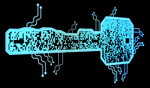

# Encrypter / Decrypter



This assignment exercises file reading and writing, random, and use of lists.
You are going to write two separate programs which work together to encrypt ("mix-up") and decrypt ("re-assemble") `.txt` files, `.py` files, and other text-based files.

Perhaps you've hear of the concept of "Encryption" in passing.
In this assignment, we are going to be writing programs that are capable of encrypting and decrypting text files.
The Wikipedia definition of Encryption goes like so:

_In cryptography, encryption is the process of encoding a message or information in such a way that only authorized parties can access it. Encryption does not itself prevent interference, but denies the intelligible content to a would-be interceptor. In an encryption scheme, the intended information or message, referred to as plaintext, is encrypted using an encryption algorithm, generating ciphertext that can only be read if decrypted. For technical reasons, an encryption scheme usually uses a pseudo-random encryption key generated by an algorithm. It is in principle possible to decrypt the message without possessing the key, but, for a well-designed encryption scheme, considerable computational resources and skills are required. An authorized recipient can easily decrypt the message with the key provided by the originator to recipients but not to unauthorized users._

We are going to implement two programs (one to encrypt a text file, and one to decrypt).

## Encrypter

The first program you will write shall be named `encrypter.py`.
The job of this program will be to encrypt ("mix" or "shuffle") the lines of a text file, but do it in such a way that it can be un-done later with a separate program (which you will also write).

When run, your program will first request a file to encrypt.
Requesting the file name will look like:

```
Enter a name of a text file to encrypt:
```

This program will then run it's encrypting (mixing) algorithm on the text file named file_name.
It will save the encrypted version of the text file to a file named `encrypted.txt`.

Your program will encrypt an input file by re-arranging the lines of the input file, based on indexes retrieved from calling `randint`.
For example, the user decide to encrypt a file named `sample.txt` that looks like this:

```
|'''''|
| 0 0 |
|  ^  |
|  -  |
 ----- 
   # 
#######
  ###
 #   #
 %   %
```

You then run 
If the user were to use `encrypter.py` to encrypt the file, the prompt and input should look like so:

```
Enter a name of a text file to encrypt:
sample.txt
```

After running, `encrypted.txt` will have the following contents:

```
#######
| 0 0 |
 #   #
|  ^  |
  ###
 %   %
   # 
|'''''|
|  -  |
 ----- 
```

All of the same lines from the original file exist in this file, but the order is not necessarily the same.

Whenever `encrypter.py` runs, it will also write an index (key) file.
This file will contain the corresponding indexes of each line in the encrypted file.
Given the example above, `index.txt` would look like this:

```
7
2
9
3
8
10
6
1
4
5
```

The number on each line of the file is the line number that each shuffled line was on in the original program.
For example: `7` is on the first line.
This means that the first line of the encrypted file was originally on line 7 of the input file.
`2` is on the second line.
This means that the second line of the encrypted file was originally on line 2 of the input file (the same line!).

Without the `index.txt` file, how would another program or a human know how to decrypt the `encrypted.txt` file.
If a human or program has both the encrypted file and the index file, it can be decrypted systematically.
Thus the index file works like a secret "key" for the program.
Whoever has access to both the index file and the encrypted text can decrypt the encrypted text.

## Decrypter

After writing `encrypter.py`, you are to write a related program named `decrypter.py`.
`decrypter.py` will take the name of a text file and index (key) file, and then it will decrypt the text.
The program will read in these two files, and using the information stored within them, it will put the contents back in the original order.
The decrypted file should be saved to a file named `decrypted.txt`

Running `decrypter.py` will look like so:

```
Enter the name of an encrypted text file:
file_name_a
Enter the name of the encryption index file:
file_name_b
```
Where `file_name_a` is the name of the encrypted file, and `file_name_b` is the name of the index file.

You should use lists and the indexes from the index file to help with getting the lines back in the correct order.

There will be multiple examples of running this program on the diff-testing tool.
Make sure to test your code carefully using the tool!

## The encrypting algorithm

The diff-testing site has several example runs of `encrypter.py`.
The examples will include what we expect the encrypted file and the index file should look like.

The contents of these files must match what we expect exactly.
In order to get the outputs to match, **you will need to follow the same encryption algorithm that is shown below**.

The steps of the algorithm are outlined below and you must implement these steps in python.
Note that the below steps are just the steps for how to determine which lines to put where in the encrypted file.
You also need to handle all of the file reading, writing, etc.

* Import the random python library
* Initialize the random library with a seed value of `125`.
  (Just put the line of code `random.seed(125)` at the beginning of main).
* However many lines there are in the input text file, repeat the following steps (line\_count * 5) times
    * Chose two random integers starting from zero and going up to the number of lines in the file minus 1
    * Swap the content of the lines at these two indexes

By choosing the seed `125`, you should get the same results if you follow the steps carefully.

## Code structure

Below are suggestions for the sequence steps for both of the programs:

### encrypter.py

* Set the random seed `random.seed(125)`
* Ask for a file name from the user
* Read the contents of the file into a list
* Create a list of indexes that is the same length as the list of lines in the file.
  This should be a list of numbers.
* Follow the encryption algorithm described earlier.
  Whenever you swap two lines in the lines list, also swap the indexes in the index list.
* After the encrypting process is complete, write the shuffled content of the lines list to `encrypted.txt`.
  Also, write the shuffled indexes from the index list to `index.txt`.
  Make sure to close both files!

### decrypter.py

* Ask the user for the name of the encrypted file
* Ask the user for the name of the index file
* Read the contents of the encrypted and index file into a list.
* Write a loop that iterates through indexes 1 through the length of the file contents list.
* Using the index list, append the contents to a new list in the decryoted (original) order.
* Write the list out to a file named `decrypted.txt`.

### Code size

For your reference, my solution to `encrypter.py` is around 43 lines of code, not including comments, and my solution for `decrypter.py` is around 26 lines of code (not including comments).
This information is meant to be encouraging, and keep you on the correct track.
The code to be written is not very long.
However, getting the encryption loop and decryption loop correct might be tricky, so start early!

## Some files from the test cases

* [sample.txt](./res/sample.txt)
* [poem.txt](./res/poem.txt)
* [few-steps.txt](./res/few-steps.txt)
* [many-steps.txt](./res/many-steps.txt)

## Submission and grading

It is due on Tuesday, Nov 1st at 7pm.

You should put all of your code in two python files, named `encrypter.py` and `decrypter.py`.
You only need to upload these two files to gradescope for this PA.
You do not need to include input / output text files.
Submit these files to Gradescope, and try your best to write your programs in such a way that they pass every test case.

