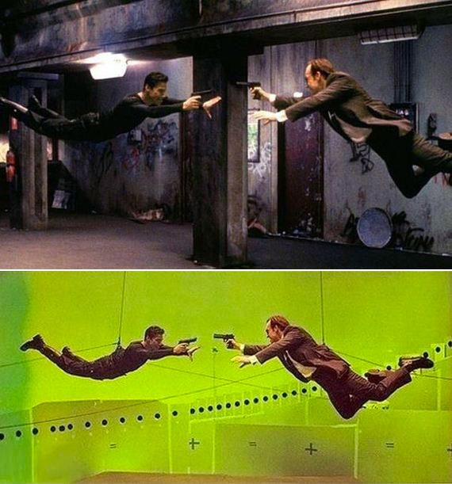

# CSc 110 - PA 12 - Greenscreen

<!--  -->

At times when constructing an image or a creating movie, the photographers or film-makers want to use a background scene that is different from the on-set location.
However, in many cases, it is unrealistic to actually take the photo or shoot a film in the ideal location, perhaps due to cost, or perhaps due to the "ideal location" not even existing.
For example: Perhaps a film-maker wants to shoot a scene on the pyramids in Egypt.
Clearly, It might be out-of-budget to fly the actors and film crew out to film the scene on the actual location.
Also, the tourists might complain!
It also might be out-of-budget to build a large and detailed moon set to film on.
Instead of doing either of those things, the film-makers can shoot footage of the actors and foreground objects with a green or blue background.
Later, during the editing process, images or video footage from the pyramids can replace the solid-colored background image.
Replacing a green background with another image or video footage is referred to as using a greenscreen.

A number of popular movies (including The Avengers, The Hobbit, Star Wars, etc) use greenscreens (or blue screens) during the process of film-making.
Shown below are several before/after examples from movies that show how a greenscreen was used to drastically change the background of a scene from a move.
(From left to right: The Hobbit, The Avengers, Alice in Wonderland).


The first example is a shot from Rivendell in the Lord of the Rings world.
Now, it is perhaps possible that the filmmakers could have searched earth for a mountainous location that fit their vision for the movie, but that would have taken time, and would have cost money to travel to film on-location.
It was probably cheaper to build a set, and then fill in the background mountains and waterfalls via a greenscreen.

The second example is from The Avengers.
It would be rather unrealistic to *actually* set off an explosion in close proximity to the actors.
Rather than doing that, they acted as if there was an explosion with a greenscreen in the background.
Later, the video editors replaced the green with an explosion.

In this PA, you'll be writing a program that can combine a still image with a green, blue, or red screen, with a background (or fill) image.
You should call your python file `greenscreen.py`.

## PPM Images

The program that you write will not operate in video footage.
Instead, it will operate on PPM images.
By this time, hopefully you are familiar with the PPM image format by now.
The program that you write will need to open PPM files and determine the image's width, height, and RGB pixel values.

If you need a refresher on the file format, read [slides from class](http://benjdd.com/courses/cs110/spring-2019/lectures/).

You can assume the following about the PPM files your program will have to process:

* The first line of the ppm file will be the format (`P3`)
* The second line will have the width and height
* The third line will have the max brightness level (typically `255`)
* The rest of the file will contain the RGB pixel values.
  Each row of the image will have its own row in the file.


## The program interface

This program will take 5 total input values.

* The first is the color channel of the screen in the background.
  This should be `r`, `g`, or `b`.
  After getting this input value, the program should ensure that it is one of these three options.
  If not, the program should print an error message and exit.
* The next input value should be a floating point number between 1.0 and 10.0.
  This will be referred to as the "channel difference".
  How to use this will be explained later.
  If the number is not between 1.0 and 10.0, the program should print an error and then exit.
* The third and fourth input values should be the two image files to combine.
  The third is the image with the red, green, or blue screen.
  The fourth is the background/fill image.
  After both of these are entered, your program should immediately check that the two images have matching widths and heights.
  If not, the program should print an error message and then exit.
* The fifth input value is the name of the file to write the new image to.

Below is an example of what the prompts for these input values should look like:

```
Enter color channel
g
Enter color channel difference
2.0
Enter greenscreen image file name
lion.ppm
Enter fill image file name
city.ppm
Enter output file name
lion_in_city.ppm
```

Once your program has all of the input values that they have been validated, then you should move on to the progress of running the greenscreen algorithm.
All of the test cases that ensure you are doing input validation will be worth extra credit.

## The Greenscreen Algorithm

Before describing the algorithm, let's define a few entities.
We will refer to the image with the red, green, or blue screen image A.
Let's call the background/fill image image B.
Also, recall the channel difference float.
for this description, lets shorten it to just CD (for Channel Difference).

You should use nested loops (either for loop or while loops) to iterate through the indexes of the rows and columns of the image.
For each pixel, the program should determine if the pixel in the new image should be the one from image A or B.
In order to do so, it should compare the value of the color of the screen (red, green, or blue) to the other two.
If the channel of the screen is greater than CD _times_ more bright than the other two channels at that particular pixel, then the pixel for the new image should be taken from image B.
Otherwise, it should be taken from image A.

For example, let's say that you are working with a green(screen) background, and the CD value is 2.0.
Now, say that you are faced with the below single pixel value from image A.

```
100 255 150
```

In this case the green value (255) is more than 2.0 times as bright as the red value (100 * 2.0 = 200.0).
However, it is not 2.0 times as bright as the blue value (150 * 2.0 = 300.0).
In this case, the pixel from image A should be used.

Now, let's say that you are working with a red(screen) background, and the CD value is 3.5, and you are evaluating this pixel from image A:

```
230 40 50
```

In this case the red value (230) is more than 3.5 times as bright as the green value (140 * 3.5 = 140.0).
It is also more than 3.5 times times as bright as the blue value (50 * 3.5 = 175.0).
In this case, the pixel from image B should be used.

## Starter code

Rather than beginning the program from scratch, start from the provided starter code, linked below.
This code contains a function that can read in the RGB data from a PPM file.

### [greenscreen.py](./greenscreen.py)

## Examples

Below I show examples of running this program with a red screen, green screen, and blue screen.
For each of the examples the displayed images will be either JPG or PNG.
However, you should download the ppm versions to run your program with.
The links to the PPMs are provided.

Test cases will not be provided on differ, at least initially.

## small_1_a / small_1_b / result_1

The below run of `greenscreen.py` with the input images linked below, will produce the output shown at the end of the table.

```
Enter color channel
g
Enter color channel difference
2.0
Enter greenscreen image file name
small_1_a.ppm
Enter fill image file name
small_1_b.ppm
Enter output file name
result_1.ppm
Output file written. Exiting.
```


<table>

<tr>
  <td> <a href="./res/ppms/small_1_a.ppm">small_1_a.ppm</a> </td>
  <td> <a href="./res/ppms/small_1_b.ppm">small_1_b.ppm</a> </td>
  <td> result </td>
</tr>

<tr>
  <td>  </td>
  <td>  </td>
  <td>  </td>
</tr>

</table>

## a / b / result_2

The below run of `greenscreen.py` with the input images linked below, will produce the output shown at the end of the table.

```
Enter color channel
r
Enter color channel difference
1.5
Enter greenscreen image file name
a.ppm
Enter fill image file name
b.ppm
Enter output file name
result_2.ppm
Output file written. Exiting.
```


<table>

<tr>
  <td> <a href="./res/ppms/a.ppm">a.ppm</a> </td>
  <td> <a href="./res/ppms/b.ppm">b.ppm</a> </td>
  <td> result </td>
</tr>

<tr>
  <td>  </td>
  <td>  </td>
  <td>  </td>
</tr>

</table>


## Lion / City / Green

The below run of `greenscreen.py` with the input images linked below, will produce the output shown at the end of the table.

```
Enter color channel
g
Enter color channel difference
1.5
Enter greenscreen image file name
lion.ppm
Enter fill image file name
city.ppm
Enter output file name
lion_in_city.ppm
Output file written. Exiting.
```


<table>

<tr>
  <td> <a href="./res/ppms/lion.ppm">lion.ppm</a> </td>
  <td> <a href="./res/ppms/city.ppm">city.ppm</a> </td>
  <td> result </td>
</tr>

<tr>
  <td>  </td>
  <td>  </td>
  <td>  </td>
</tr>

</table>


## Dog / Roller Coaster / Blue

The below run of `greenscreen.py` with the input images linked below, will produce the output shown at the end of the table.

```
Enter color channel
b
Enter color channel difference
1.7
Enter greenscreen image file name
dog.ppm
Enter fill image file name
rc.ppm
Enter output file name
dog_on_rc.ppm
Output file written. Exiting.
```

<table>

<tr>
  <td> <a href="./res/ppms/dog.ppm">dog.ppm</a> </td>
  <td> <a href="./res/ppms/rc.ppm">rc.ppm</a> </td>
  <td> result </td>
</tr>

<tr>
  <td>  </td>
  <td>  </td>
  <td>  </td>
</tr>

</table>

## Dog / Bones / Red

The below run of `greenscreen.py` with the input images linked below, will produce the output shown at the end of the table.

```
Enter color channel
r
Enter color channel difference
4.7
Enter greenscreen image file name
dog2.ppm
Enter fill image file name
bones.ppm
Enter output file name
dog_with_bones.ppm
Output file written. Exiting.
```

<table>

<tr>
  <td> <a href="./res/ppms/dog2.ppm">dog2.ppm</a> </td>
  <td> <a href="./res/ppms/bones.ppm">bones.ppm</a> </td>
  <td> result </td>
</tr>

<tr>
  <td>  </td>
  <td>  </td>
  <td>  </td>
</tr>

</table>


## Due Date

**NOTE: You may NOT use a late day for this assignment!!!**

This PA is due on Friday, Dec 2nd, 2022.
You may NOT use a late day for this assignment.
Turn it in via Gradescope.

