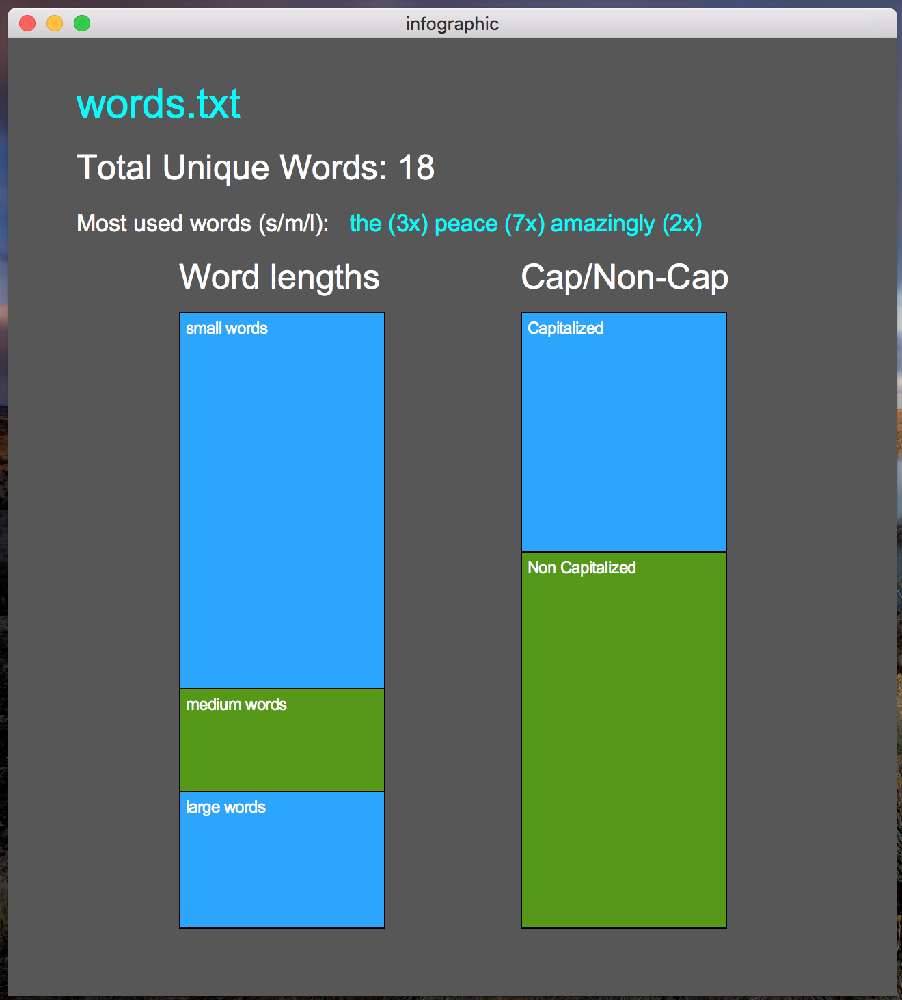
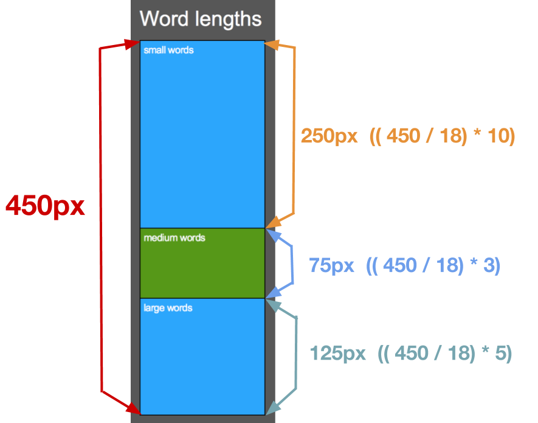
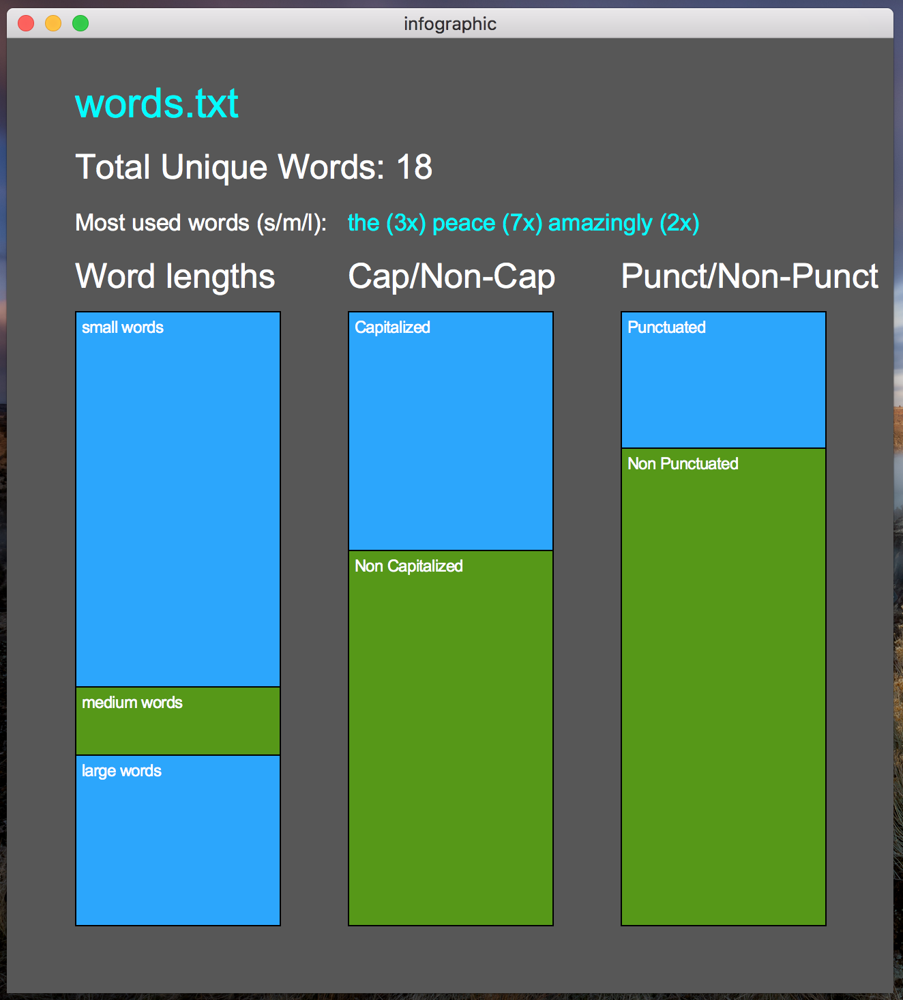
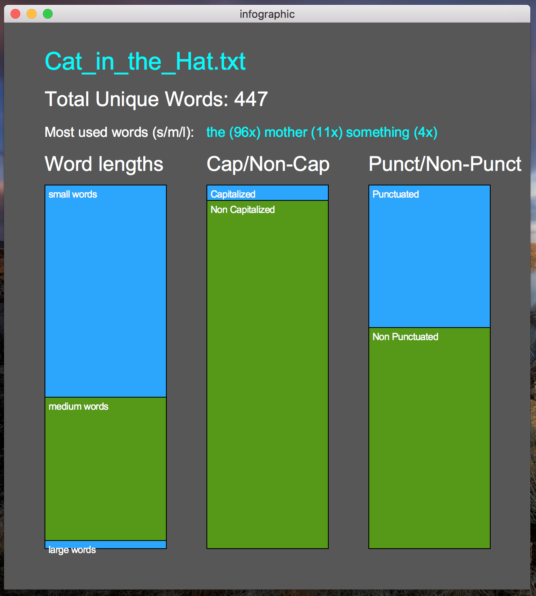
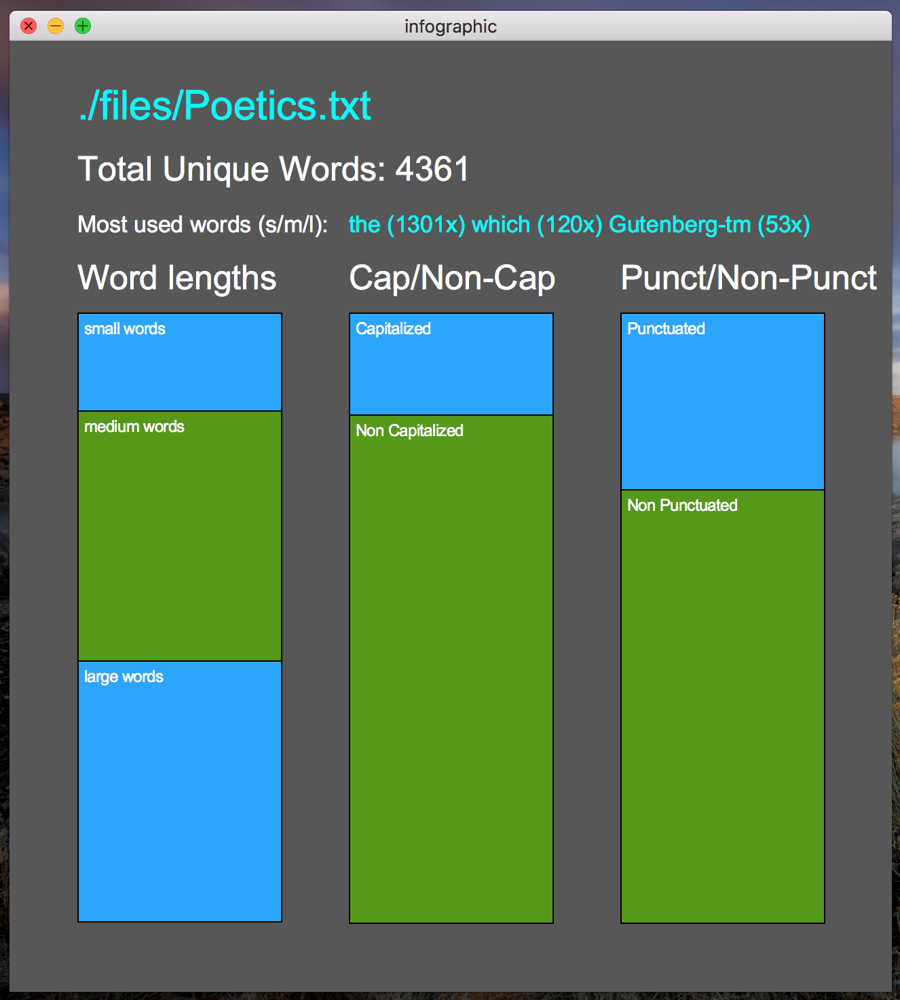
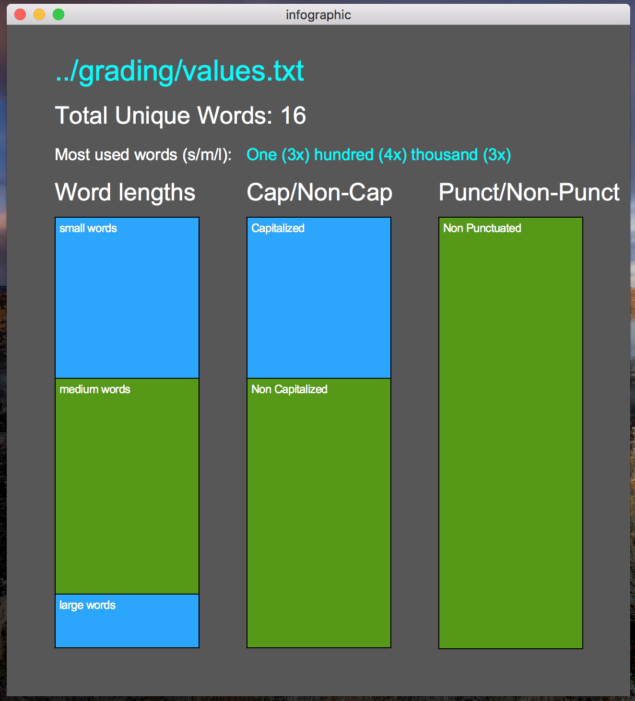

# Infographic



In this PA, you will be writing a program that reads in a text file (perhaps containing the contents of a book, poem, article, etc) and produces an infographic based on the text.
You will need to use one or more dictionaries to count words in the program.
You may also use lists and / or sets.
Below, you can see three example infographics that your program should be able to generate:

The infographic should contain the following information about the text:

* The name of the text file
* The total number of unique words.
* The most used small, medium, and large words in the file.
  Both the word and the count should be included, as shown in the image.
  For the purposes of this PA, the definitions of a small, medium, and large word is:
    * small: length 0-4, inclusive.
    * medium: length 5-7, inclusive.
    * large: length 8+, inclusive.
* A Bar-chart representing the proportion of unique small, medium, and large words.
* A Bar-chart representing the proportion of capitalized and non-capitalized words.
  A capitalized word is any word that begins with an upper-case letter.
  All other words can be considered non-capitalized, even if they begin with a non-letter character like a digit or punctuation.
* **Extra-Credit:** A Bar-chart representing the proportion of punctuated and non-punctuated words.
  A Punctuated word is any word that ends in a period, comma, question-mark, or exclamation-point.
  All other words should be considered non-punctuated.

You can take creative liberty with the colors, but the text and graphics displayed should be in roughly the same positions as what is show on this spec.
The canvas size should be proportional to mine (650 pixels wide, 700 pixels tall), but it does not have to be exactly this.
Name the file `infographic.py`.
You should also re-download [graphics.py](./res/graphics.py), and use that for the graphical component.

## Development Strategy

### (1) Reading and processing the file

The first step should be to ask the user for the input file that they would like to have an infographic created for.
Once the file has been selected, you can read in all of the lines and strip the newlines off of the ends.
To get the words, all you have to do is split each line on whitespace.
To accomplish this, just call `split()` on each line string, with no argument.
You can then append each individual word to a python list.
You do not need to strip off punctuation from the words or normalize the cases.

For example, if you input file had the following content:

```
two forks.
one knife.
two glasses.
one plate.
one naptkin.
his glasses.
his knife.
```

The words list should have the following content after processing the file:

```
words = ['two', 'forks.', 'one', 'knife.', 'two', 'glasses.', \
         'one', 'plate.', 'one', 'naptkin.', 'his,' 'glasses.', 'his', 'knife.']
```

### (2) Counting words

Once you have a list of all of the words from the file, you can count the occurrences.
You should use a dictionary for this.
Continuing from the example of the last step, the dictionary should have the following contents:

```
word_counts = {'two':2, 'one':3, 'forks.':1, 'knife.':2, \
               'glasses.':2, 'plate.':1, 'naptkin.':1, 'his':2}
```

### (3) Finding most occurrences

Next, you can find the small, medium, and large words that occur the most.
In the example, it would be `one` for small, `knife.` for medium, and `glasses.` for large.
You can do this by iterating through the key and value pairs in the `word_counts` dictionary, and keeping track of which has the highest count.
Then, display these on the canvas.

### (4) Counting Capitalized

Next, compute how many unique capitalized and non-capitalized.
You can do this by getting the keys of the `word_counts` dictionary as a list, and then looping through them all.

### (5) Counting Punctuated (Extra Credit)

Compute how many unique punctuated and non-punctuated words there are.
Use a similar process as you did for step (4).

### (6) Building the bar charts

You should display two (or three, if doing the extra credit) bar charts on the infographic.
This section will walk though how to build it the Small, Medium, and Large word Bar Chart (SMLBC).
You can apply similar steps to the other two.

Let's say you were trying to build the SMLBC for an input file with 10 unique short words, 3 unique medium words, and 5 unique large words.
In total, this is 18 unique words.
The small box should consume 10/18 of the whole bar, the medium bar should consume 3/18 of the whole bar, the large word bar should consume 5/18 of the whole bar.
To calculate the height in pixels of each bar, use the formula: 

```
(pixel_height / total_item_count) * category_item_count
```

For example, if the total height of the bar chart should be 450 pixels, then to get the height in pixels of the small word bar: `(450 / 18) * 10`.
Take a look at the image below for reference



Use this information to draw the other one or two bar charts.

## Resource Files

Below are some resource files you might find interesting to run your program with.

* [poem.txt](./res/files/poem.txt)
* [Bible.txt](./res/files/Bible.txt)
* [Cat_in_the_Hat.txt](./res/files/Cat_in_the_Hat.txt)

If you'd like to try the program on other books, you can visit [www.gutenberg.org](http://www.gutenberg.org).

Most of the test cases on Gradescope will not be super large.
They will be 1000 lines of text at most.

## Examples

Below are several examples, with the input files included.
If you are not completing the extra credit, you only need to include the first two bar charts.

|---|---|
|  | [words.txt](./res/files/words.txt) |

|---|---|
|  | [Cat_in_the_Hat.txt](./res/files/Cat_in_the_Hat.txt) |

|---|---|
|  | [Poetics.txt](./res/files/Poetics.txt) |

|---|---|
|  | [values.txt](./res/files/values.txt) |

## Submission

Submit this code to Gradescope by Tuesday, November 22nd by 7pm.

<br/>

*Special thanks to Ping Hsu, whose programming assignment spec this was partially inspired by!*

