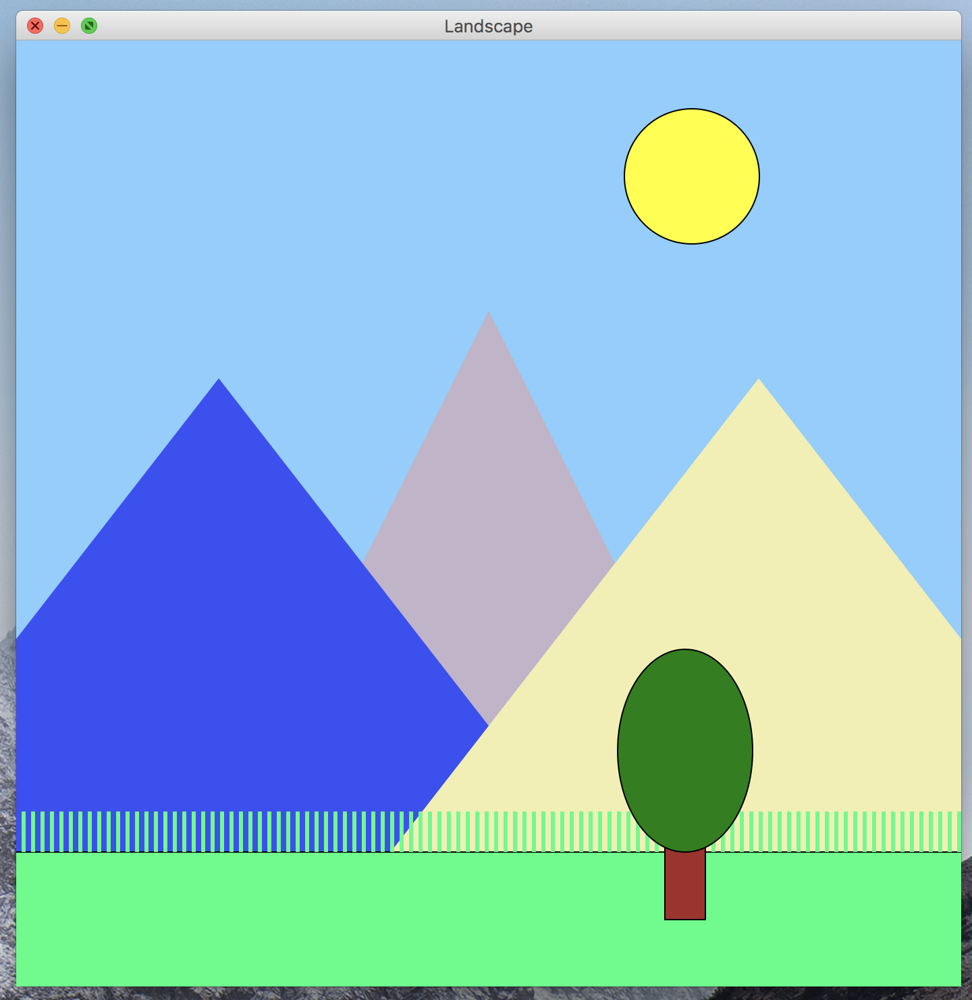
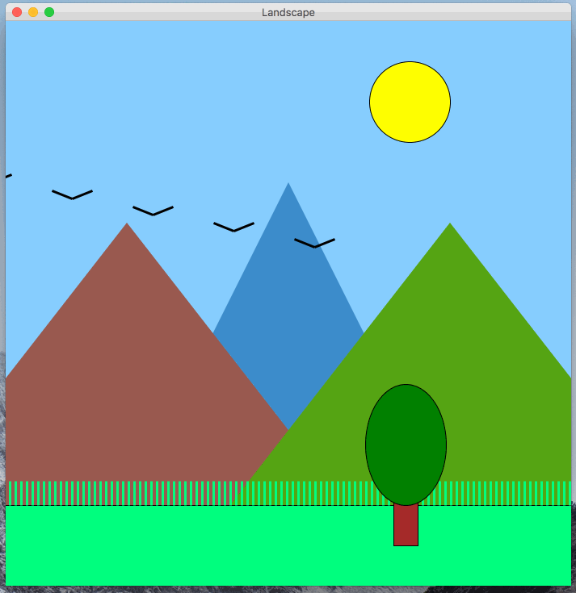

# CSc 110 - Motion Parallax 

In this programming assignment, you will be building a program that displays a landscape in a graphics canvas and allows the user to control the perspective of the landscape by moving the mouse.
The perspective seems to change due to an effect called motion parallax, which you should implement in this program.
The above gif shows an example of the user interacting with a completed version of the program.

You should follow the below guidelines when designing your landscape.

* Name your program `motion_parallax.py`.
* The canvas that the landscape is on should be square.
  It should be between 500 x 500 and 750 x 750 pixels.
* The foreground should contain a grass field, (with blades of grass grass), and a tree.
  You must use a loop to generate the blades of grass, and there must be at least 20 blades.
  For the tree, you must use at least one rectangle and one ellipse.
  You are welcome to make the tree more elaborate if you'd like.
  You are also welcome to add other things to the foreground, such as other foliage.
  Get creative!
* There should be two layers for the mountains (two in the closer layer, and one in the father layer).
  The closer layer should have two shorter mountains, to the left and to the right of the mountain that is further away.
  There should also be a single mountain roughly centered on the canvas, which should appear further away than the two on it's sides.
* The color of each mountain should be chosen randomly.
  Thus, each time the program is executed, you may get different colors than the previous time the program was run.
  You may want to use the `get_color_string` function to help you go from random numbers to a valid color string.
* The sky should contain a sun.
* The sky should be blue.
* There should be 5 birds that repeatedly fly across the screen.
  You should also use a loop to repeat the birds.
* You are welcome to add additional things to the landscape: clouds, sun rays, other foliage, snow caps on the mountains, etc.

All of the graphics should be displayed using the `graphics.py` module.
Remember to put `graphics.py` in the same directory as `motion_parallax.py`.
You can refer to the slides from section if you forgot how to work with the `graphics` module.
This program does not take any input values from the command-line, and does not need to print anything on the command-line either.

Also, there will be not autograder tests on Gradescope for this.
The TAs will grade submissions by trying to run your programs.
Thus, you should be careful to make sure your program behaves very similar to the examples that are shown on this spec.

## Program Structure

This program must follow the style guidelines.
You should structure all of the code into functions.
The only code that is allowed to not be in a function are your `import` statements and a call to `main()`.
You should create a function for each visual component / category in the program.
For example, you might create one function to draw the birds, another function to draw the foreground, etc.

## Motion Parallax

As you can see in the example, the perspective of the landscape changes as the mouse moves.

When the mouse moved up/down (y axis), the perspective follows.
The components of the landscape move upwards/downwards.
Similarly, when the mouse moved left/right (x axis), the perspective follows.
The components of the landscape move left/right.

If you pay close attention, You'll notice that the some components on the canvas move more than others as the mouse moves.
This effect is a cue to your visual system and brain that the objects that more more are closer, and the objects that move less are farther away.
This is referred to as **parallax** or **motion parallax**.
You can read about it more on the [parallax Wikipedia page](https://en.wikipedia.org/wiki/Parallax).

You should divide the components of the landscape into four layers:

* Layer 1: The sun
* Layer 2: The middle mountain
* Layer 3: The side mountains
* Layer 4: The grass, tree, and foreground

Each layer should move as the mouse moves, but the amount of movement should be different depending on the layer to achieve the visual parallax.

## Development Strategy

Don't try to tackle the entire program at once.
Work on one component at a time, and work on getting the program to function similarly to the example one component at a time.
Below are some steps that you may consider following.

### Step 1: Blue Canvas

Initially, get a program that generates a square canvas, and fill the canvas with a blue rectangle.
The blue rectangle can serve as the sky.

### Step 2: The Static Image

Next, work on getting a static landscape displayed.
At this point, don't worry about the motion parallax, random mountain colors, or the birds.
The shapes will be added the canvas in the order you add them programmatically.
Thus, to get one shape to show up above another, draw it after.
Thus, draw layer 1 first, then 2, then three, and then 4.

### Step 3: Random Mountain Color

Update the program so that it generates three random colors for the mountains on each program run.
In order to test, run the program a few times and check if the color of each mountain changes.

### Step 4: The Birds

Next, add the birds to the canvas.
You should use a while loop.
You are not required to make the birds move, or to be a part of the parallax.
You just need to draw them on the screen in a slight downward slope, as shown in the picture below.

For one point of EXTRA CREDIT, you can make the birds move across the screen and wrap around the screen, as shown below.

### Step 5: Motion Parallax

Finally, add in the parallax!

Before you attempt to code it up, take some time to think how you should accomplish this.
Take a close look at the example earlier in the spec and the one below.
You should compute a value that you can use to offset the positions of the shapes in each layer.
You should use the x and/or y mouse positions in the calculations of the offsets.
If you forgot how to access the x and y position of the mouse, check the slides!

## Bonus!

There will be two ways in which you can earn bonus points for this PA.
As previously mentioned, you can get one bonus point if you make the birds move and wrap-around the view of the canvas.
You can also potentially get a bonus point for WOW-FACTOR.
If you do something particularly unique or creative with your solution that really stands out, we may give you an extra point!

A few examples of this would be something like:

* In addition to the tree and grass, Create some interesting and detailed elements in the foreground.
* Have the landscape transition between night and day.
* Add some additional elements to the upper portion of the scene, such as moving clouds, or rays of sunlight.

## Submission

This PA is due on Tuesday, October 11th, at 7pm.
You should turn it in on Gradescope.
Remember: there are not going to be autograder test cases, so do the best you can to match the correct behavior described and shown in the spec.

