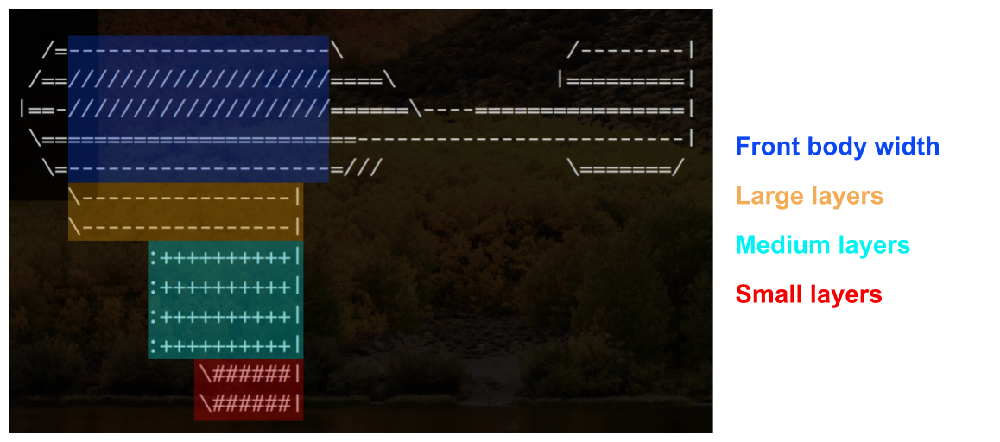

# CSc 110 - PA 1 - Star Wars

In this PA, you will be writing multiple programs that print out ascii art of star-wars vehicles.
Each of these programs shoult accept multiple values from the user which are used to adjust the size of the printout.
You should work on them in the order shown.

## Printing a TIE-fighter


In the this program, you will print out a tie-fighter (an example of this spacecraft is shown above).
Name your program `tie.py`.
Your program should ask the user for one number; the width of the tie fighter.
The number that your program accepts should control the width of the "arms" that extend out on each side of the tie fighter.
The height of the fins and the size of the center can remain the same size regardless of the value that the user enters.
Below are several examples of this program running with different input values provided.
Your program should match the look of the TIE fighter exactly.
You can use the differ tool to check that your output matches.

```
Enter TIE width:
7

|[                       ]|
|[        /=---=\        ]|
|[///////|== X ==|\\\\\\\]|
|[        \=---=/        ]|
|[                       ]|
```

```
Enter TIE width:
15

|[                                       ]|
|[                /=---=\                ]|
|[///////////////|== X ==|\\\\\\\\\\\\\\\]|
|[                \=---=/                ]|
|[                                       ]|
```

```
Enter TIE width:
5

|[                   ]|
|[      /=---=\      ]|
|[/////|== X ==|\\\\\]|
|[      \=---=/      ]|
|[                   ]|
```

Notice that the integer read in is read in on a new line, and that there is an empty space between the line where the integer is read in and the first line of the TIE fighter.
Try putitng a `\n` at the end of the input prompt string to accept the integer on the next line..
Any integer number 0 or greater should be supported.
You don't need to worry about handling negative numbers, fractions, or numbers with decimals.


## ATAT


In this program program, you will print out a AT-AT (an example of this machine is shown above).
Name your progam `atat.py`.
Your program should ask the user for three numbers; the neck length, the body height, and the leg height.
The neck length controls how long the neck of the AT-AT, made out of dashes.
The body height will control how tall the top part of the AT-AT body, above the neck.
The leg height controls the height of the legs.
Below are serveral examples of this program running with different input values provided.

```
Neck Length:
0
Body Height:
0
Leg Height:
0

     _..-Y  |  |  Y-._
 .--"   ||  |  |  |   "-.
 |______________________|    _____
 L______________________[----------).
I____________________ [__L][----(_}--P
L________________________j~ '+++++++//
\________________________]
  [___________________]
     I--I"~~"""~~"I--I
     ([])         ([])
    /||||\       /||||\
   |=}--{=|     |=}--{=|
  .-4----4-.   .-4----4-.
```

```
Neck Length:
1
Body Height:
2
Leg Height:
3

     _..-Y  |  |  Y-._
 .--"   ||  |  |  |   "-.
 |______________________|
 |______________________|
 |______________________|     _____
 L______________________[-----------).
I____________________ [__L]_[----(_}--P
L________________________j~  '+++++++//
\________________________]
  [___________________]
     I--I"~~"""~~"I--I
     |\n|         |\n|
     |\n|         |\n|
     |\n|         |\n|
     ([])         ([])
    /||||\       /||||\
   |=}--{=|     |=}--{=|
  .-4----4-.   .-4----4-.
```

```
Neck Length:
7
Body Height:
7
Leg Height:
5

     _..-Y  |  |  Y-._
 .--"   ||  |  |  |   "-.
 |______________________|
 |______________________|
 |______________________|
 |______________________|
 |______________________|
 |______________________|
 |______________________|
 |______________________|           _____
 L______________________[-----------------).
I____________________ [__L]_______[----(_}--P
L________________________j~        '+++++++//
\________________________]
  [___________________]
     I--I"~~"""~~"I--I
     |\n|         |\n|
     |\n|         |\n|
     |\n|         |\n|
     |\n|         |\n|
     |\n|         |\n|
     ([])         ([])
    /||||\       /||||\
   |=}--{=|     |=}--{=|
  .-4----4-.   .-4----4-.
```

## Nebulon 8


In this program, you will print out ascii art of the nebulon spaceship (an example of this machine is shown above).
Name your progam `nebulon.py`.
Your program should ask the user for four numbers; The number of small/meduim/large layers on the bottom-front of the ship, and the width of the front of the ship.
Below is a diagram showing what component of the ship each input value determines.



The Large, med, and bottom later inputs determine the height of those three components.
The last input determines how long (wide) each of the upper components are.
_(Don't worry about trying to make your ship printout match the above image.
Instead, use the test cases)_

Below are serveral examples of this program running with different input values provided.

```
Large Layers on bottom:
1
Medium Layers on bottom:
1
Small Layers on bottom:
1
Front length:
10

  /=----------\                 /--------|
 /==//////////====\            |=========|
|==-//////////======\----================|
 \==============-------------------------|
  \=----------=///              \=======/
    \------|
     :+++++|
       \###|
```

```
Large Layers on bottom:
3
Medium Layers on bottom:
2
Small Layers on bottom:
1
Front length:
15

  /=---------------\                 /--------|
 /==///////////////====\            |=========|
|==-///////////////======\----================|
 \===================-------------------------|
  \=---------------=///              \=======/
    \-----------|
    \-----------|
    \-----------|
        :+++++++|
        :+++++++|
          \#####|
```

```
Large Layers on bottom:
2
Medium Layers on bottom:
4
Small Layers on bottom:
2
Front length:
20

  /=--------------------\                 /--------|
 /==////////////////////====\            |=========|
|==-////////////////////======\----================|
 \========================-------------------------|
  \=--------------------=///              \=======/
    \----------------|
    \----------------|
          :++++++++++|
          :++++++++++|
          :++++++++++|
          :++++++++++|
              \######|
              \######|
```

Notice that the length of the front section of the ship also increases the length of the bottom layers.
Thus, the bottom layers need to be able to grow in length, depending on the values entered.

For the first three input values, you only need to support values greater than 0 and less than 10.
For the last input value, you only need to support values greater than 9 and less than 25.

The formula to determine the lengths of the lower layers is as follows:

* Large layer: the length of the front minus 4.
* Medium layer: the length of the front divided by 2, rounded down.
* Small layer: the length of the front divided by 3, rounded down.

## Commenting

You should also include a comment at the top of the code file.
The comment should include your name and a short description of what the program does.
Below is a template you may use:

```
### 
### Author: Your Name Here
### Description: Describe your program with one
###              or more sentences of text.
###
```

### Requirements and Restrictions

You should not use any python libraries or features that will not have been covered by the time this PA is due.
You should be using string multiplication to get the sizing of the output correct.
We will be checking that your code fulfills the requirements, has good style, etc.
You are not allowed to use if-statements or for-loops.
We will be checking that your code fulfills the requirements, has good style, etc.
Receiving full points on all of the Gradescope test cases does not guarantee you an A.


## Due Date

This PA is due on Tuesday, September 6th, at 7pm.
Turn in the programs via on Gradescope.
You should make sure that your final submission passes all of the test cases.
Passing all test cases does not guarantee a perfect grade.
Your code will also be graded on style and formatting.


