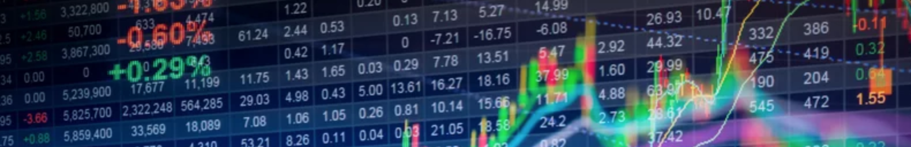
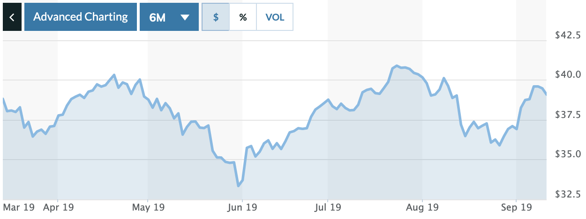
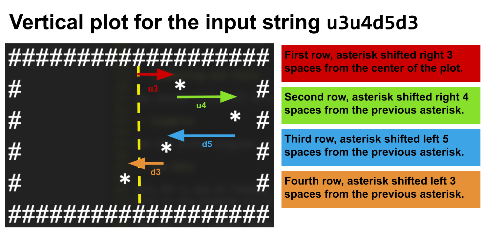
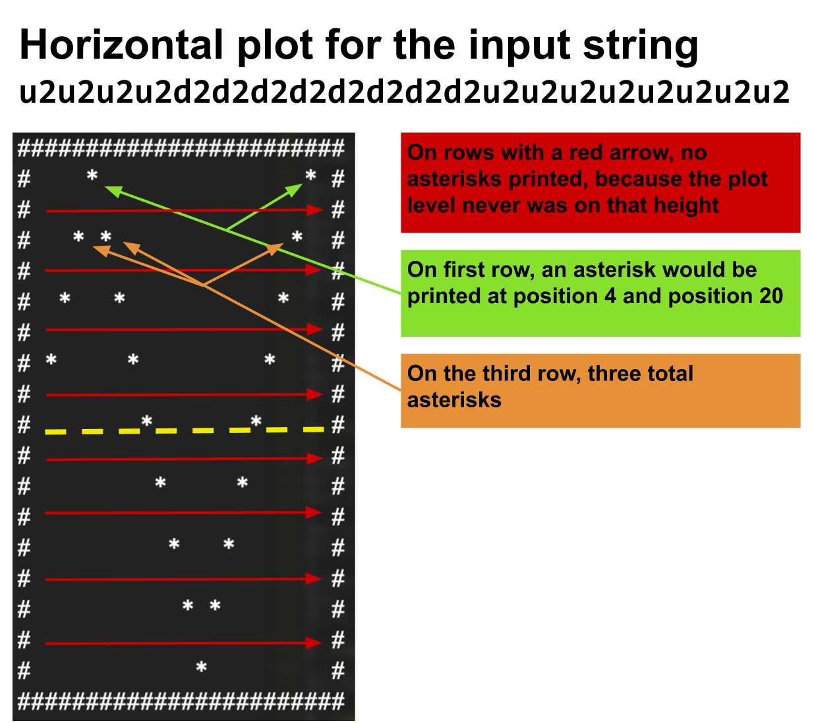

# CSc 110 - Stock Plotter



Investing in the stock market can seem a daunting task form many, especially college-aged, students.
Though there are a lot of intricacies in investing in a stock market, the core concept is rather simple.
Companies can sell stock (small pieces of ownership) of their company to individuals.
When an individual buys stock in a company, they are purchasing a small portion of that company.
The value of that stock fluctuates depending on the performance of the company - if it doing well, the value of that stock can go up!
If the company is not doing well, or there is a general economic recessions, the value of that chunk might decrease in value.
Individuals can buy and sell stock, and in an ideal scenario, make a profit off of their investment.

In this programming assignment, you will be writing some code that produces a plot of a particular stock's performance.
For instance, take a look at the image below.



This image represents the performance of GM's stock over the course of six months (GM = General Motors. Let's just say, they make a lot of cars).
The plot shows the performance from March 2019 to September 2019.
As you can see, in March, a single stock in GM was valued at about $39.
In June, it dropped to round $33, and it reached a peak of about $41.
The program you should write will be capable of reading an input string, which specifies the plot, and generate a text plot of a stock.
For instance, here's a text-based plot that mimics the GM plot above.

```
#####################################################################
#                                                                   #
#                                                                   #
#                                                                   #
#                                                                   #
#                                                                   #
#                                            ****   *               #
#                                           *    * * *              #
#                 ***                  *** *      *             **  #
# *          * **    **             ***   *           *        *  * #
#  **       * *  *     **          *                     ***  *     #
#    *     *             **     ***                    **   **      #
#     **                       *                                    #
#       ***                *  *                                     #
#                           *                                       #
#                            *                                      #
#                                                                   #
#                                                                   #
#####################################################################
```

You should name the the file `stock_plotter.py`.

## The program interface

This program works by accepting 2 values.
The first value is a string, specifying the mode to run in.
The first input should be one of two strings: `vertical` or `horizontal`, which should control the orientation of the plot.
The second input should be a string, which will specify the way the plot should be drawn.
This will be covered more in a later section of this spec.

Below is an example of the program prompting for these two inputs:

```
Enter stock plotter mode:
horizontal
Enter stock plot input string:
u0d1d2u0u1
```

So, what is the deal with that plot string?
What does it mean?
Read on . . .

## The plot string

This plot string should begin with either a `u` or a `d` (representing "up" or "down").
From the first character onward, every-other character in the string should also be a `u` or a `d`.
Following each u/d will be an integer number between 0-9 (inclusive).
That integer number will control how much up or down the plot should move.

<table style="float:right;">

<tr>
  <td style="background-color:#ededed;"><b>horizontal</b></td>
  <td style="background-color:#ededed;"><b>vertical</b></td>
</tr>

<tr>
  <td class="topic-general">
    <pre><code>#########
#       #
#       #
#       #
#       #
#       #
#       #
#       #
#       #
# *     #
#  *    #
#     * #
#   **  #
#       #
#       #
#       #
#       #
#       #
#########</code></pre>
  </td>
  <td class="topic-general">
    <pre><code>######################
#         *          #
#        *           #
#      *             #
#      *             #
#       *            #
######################</code></pre>
  </td>
</tr>

</table>

For instance, this is a valid plot string:

## u0d1d2u0u1

Let's break the string down.

* The first part, "u0", means to place the next (the first) asterisk in the plot up 0 from the center of the plot.
* "d1" means that the next asterisk should be one lower than the previous one.
* "d2" means to go down two from the previous asterisk.
* "u0" means to go up 0 from the previous one (which would put it at the same height as the previous one).
* "u1", go up one from the previous.

The table to the right shows the plot that would be produced from this plot string, in each mode.
Note that this is a rather short plot string.
Some of the test cases will be much longer

Also, notice that there are two directions of plotting, horizontal and vertical.
Horizontal mode is the more common way to represent stock plots.
The value of the stock is represented on the vertical axis, and time is on the horizontal axis.

The *vertial* plot is basically the same, but rotated 90 degrees.
The "top" of the plot represents the beginning time-wise.
Time progress downward.
An increase in a stock value is the right direct, and a decrease is left.

The plot showed previously, that was designed to mimic the GM stock plot, was produced from the following plot string:

```
d0d1d0d1d1u0d1u0d0u2u1u1d1u1u0d1u2u0u0d1d0d1d0d1d0d2d1d1u2u1u1u0u0u1u1u0u0u1u0u0d1u1u1u1u0u0u0d1d1u1u1d1d2d2d0u1u0u0d1d0u1u1u1u0d1
```

## Development Strategy

### (1) Get the category

Start by asking the user for a string input, which should either be the string "horizontal" or "vertical".
Your program should validate this input to ensure it is one of the two expected values.
If it is not, it should continue to ask the user for a valid input, as many times as it take to get one.
You should use a while-loop to do this, instead of using an if-statement.
Remember, this about a while-loop as an if statement that can repeat!
For instance:

```
Enter mode (horizontal or vertical):
vert
Enter mode (horizontal or vertical):
what?
Enter mode (horizontal or vertical):
vertical
```

### (2) Get the plot string

After getting and validating the first input, as for the second input, the plot string.
You also must validate the plot string.
The plot string *must* have a length that is a multiple of two (even).
You should check for this, and repeatedly as the user for a valid plot string until one is received.
For instance:

```
Enter a stock input string:
u1d1u1d1u
Enter a stock input string:
d1d1d1111
Enter a stock input string:
u1d1u1
```

### (3) Vertical plot



Though the vertical plot is the less "common" type of plot, it is easier to code up, so I recommend you start with that one.

Initially, you should print out 19 `#` characters (that is the max width of the plot).
To control how many rows print out, you should iterate through the indexes of the plot string.
Each pair of `u`/`d` and an integer gives you the information you need to know to print out a single row.
The default starting point of the middle of the plot is right in the center, 
You should write a while-loop that iterates through the indexes of the input plot string.
Shown below is a diagram that should help you figure out how to go from a string to a vertical plot.
In order to do so, you should use a while loop, some variables, string multiplication, and some if statements.

It's possible to accomplish this part of the plot in 15-20 lines of code.
You aren't *required* to do so in that little, code, but I let you know to help you keep on the right track.
If it takes you more, say 30 or 40, that is OK.

### (4) Horizontal plot



Though it looks nicer, the horizontal plot is a bit trickier to get right.
For this plot, you will want to write a while loop within a while loop (a nested while loop)
This is due to only being able to print one single row at a time.

The first (outer) loop should be used to control each row printed out.
Not including the top and bottom rows of `#`, there will be 17 inner rows, so the outer lop should repeat 17 times, one for each row.

Within each row, we need to figure out which parts of the plot should print out on that row.
Thus, the inner loop should iterate through the entire plot string, and should determine if any of the points on the plot should "land" in that row.
If so, it should print out an asterisk, and if not, just an empty space.

You can follow the below outline for the horizontal plot printing:

* Print the top row of `#` characters.
* Create an outer loop, to iterate between the numbers 0-16.
    * Within the outer loop, create a variable to keep track of the current level of the plot.
    * It should stat at the middle value (8).
    * Create an inner loop, to iterate through all of the `u`/`d` and integers plot pairs
        * Update the current level, by addint to or subtracting from the level variable
        * Print out either a space or a `*`, depending on if the level should be printed on the row being printed.
* Print the bottom row of `#` characters.

## Commenting and Style

You should follow all of the code style and structure rules describes in the style guide, available from the class website.

## Examples

See the differ program, or gradescope, for some example outputs.

## Due Date

This PA is due on Tuesday, September 27th at 7pm.
Turn in the program via Gradescope.
You should make sure that all of the test cases pass before you turn it in.
You can still submit without all of the cases passing, but that is not preferable.

