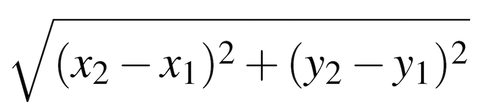

# Prep Problem - 16

In this problem, you should write one function named `calculate_distance`.
This function should accept four paramters, representing two paits of coordinates on an X/Y coordinate plane.
The first two represent x1 and y1, and the 3rd and 4th represent x2 and y2.
The function should plug these numbers into the distance formula (shown below), calculate the result, and return the result rounded to four decimal places.

A few examples of parameters and return values are shown below:

* For the parameters `0`, `0`, `5`, and `5`, the function should return `7.0711`
* For the parameters `20`, `4`, `3`, and `7`, the function should return `17.2627`
* For the parameters `100`, `52`, `30`, and `75`, the function should return `73.6817`

Make sure to include only the one function in your file.
The gradescope tests will call the functions to test them.
Name the program `prep16.py`.
Make sure that gradescope gives you the points for passing the test case.

